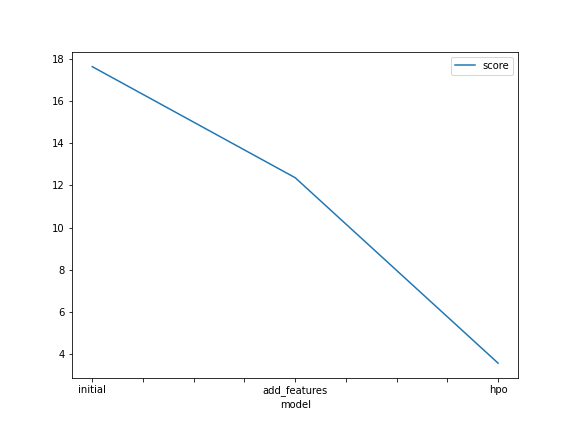
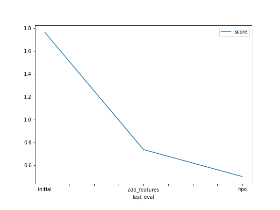

# Report: Predict Bike Sharing Demand with AutoGluon Solution
#### Maria Isabel Gomez

## Initial Training
### What did you realize when you tried to submit your predictions? What changes were needed to the output of the predictor to submit your results?
It was mandatory to check if there were any negative (below zero) predictions, because kaggle won't allow them.

### What was the top ranked model that performed?
The top ranked model was the WeightedEnsemble_L3.

## Exploratory data analysis and feature creation
### What did the exploratory analysis find and how did you add additional features?
I found that some categorical variables were being read as integers.

I added the variables: year, month, day and time.

### How much better did your model preform after adding additional features and why do you think that is?
It didn't. Sometimes it's better to go with simpler models.

## Hyper parameter tuning
### How much better did your model preform after trying different hyper parameters?
It didn't.

### If you were given more time with this dataset, where do you think you would spend more time?
Understanding ans learning new ways of optimizing hyperparameters. 

### Create a table with the models you ran, the hyperparameters modified, and the kaggle score.
|model|hpo1:Number of trials|hpo2: scheduler|hpo3: searcher|score|
|--|--|--|--|--|
|initial|NO|NO|NO|1.76|
|add_features|NO|NO|NO|0.73|
|hpo|20|Local|Random|0.5|

### Create a line plot showing the top model score for the three (or more) training runs during the project.

TODO: Replace the image below with your own.

### Create a line plot showing the top kaggle score for the three (or more) prediction submissions during the project.

TODO: Replace the image below with your own.

## Summary
Even though it is important to add new features and optimize hyperparameters, sometimes the simplest models work better.
